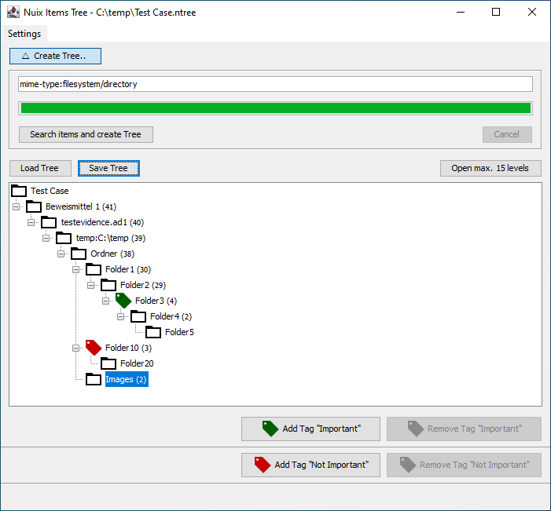

Nuix Items Tree
===========
Enables the user to search for important/not important nuix items in a tree and tag these items.

# Setup
Download the latest release and extract the contents of the archive into the Nuix scripts directory. When using Windows the script directories are:

- `%appdata%\Nuix\Scripts` - User level script directory
- `%programdata%\Nuix\Scripts` - System level script directory

# Usage

The script requires an open Nuix case. When running the script the frame is displayed. In the upper area is a toggle button which enables the search field. In the lower area the resulting nuix items are shown by their path as tree.

## Generate Tree

First you need search for items to generate a tree structure for. To show all directories you can for example search for `mime-type:filesystem/directory`.
The result is shown as tree in the lower half of the window. After the tree is shown the search area can be hidden.

For many items the tree generation takes some time, therefore the generated tree can be saved and loaded. When generating the tree it is automatically saved after the generation is completed.

## Tag Important/Not Important items

Nuix items can be tagges as "important" or "not important" by selecting them in the tree and click the corresponding button on the bottom.
It is only possible to tag items when the shown tree matches the Nuix case. A loaded tree from another case can be opened but not tagged.
After tagging the tree is automatically saved.

# Settings

In the settings panel various settings can be adjusted:

| Setting | Description |
|--------|-------------|
| Path | The path where trees are saved/loaded |
| Search-Query | The default search query |
| Tage Name "Important"  | The name of the tag which is used for tagging important items |
| Tage Name "Not Important"  | The name of the tag which is used for tagging not important items |
| Max-Level  | The maximum level for which the tree is opened on clicking the corresponding button |